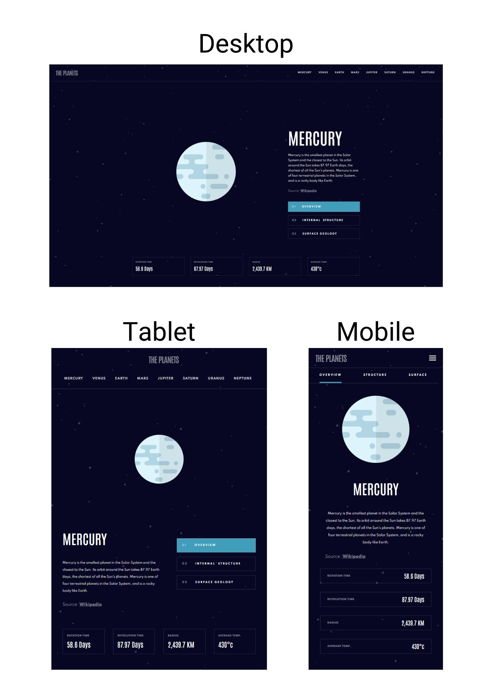

# The Planets

## Table of contents

- [Overview](#overview)
  - [The challenge](#the-challenge)
  - [Screenshot](#screenshot)
  - [Links](#links)
- [My process](#my-process)
  - [Built with](#built-with)
  - [Continued development](#continued-development)
- [Author](#author)

## Overview

### The challenge

Users should be able to:

- View the optimal layout for the app depending on their device's screen size
- See hover states for all interactive elements on the page
- View each planet page and toggle between "Overview", "Internal Structure", and "Surface Geology"

### Screenshot

### Links

- Github Repository: https://github.com/Glebkas/planets
- Live Site URL: https://glebkas.github.io/planets

## My process

### Built with

- Semantic HTML5 markup
- CSS custom properties
- BEM
- Flexbox
- CSS Grid
- Mobile-first workflow
- [React](https://reactjs.org/) - JS library

### Continued development

- All data transitions should have animations
- React Router should be implemented

## Author

Guy Gleb Kasner
